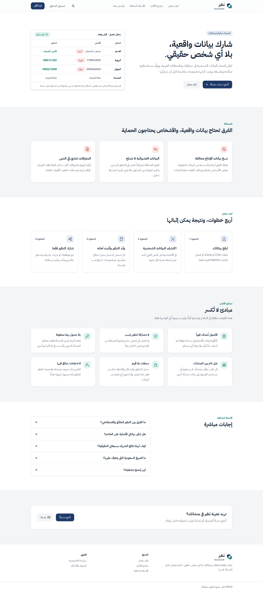
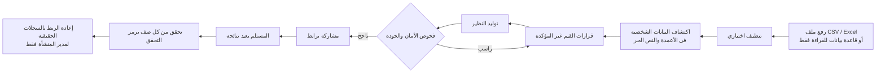
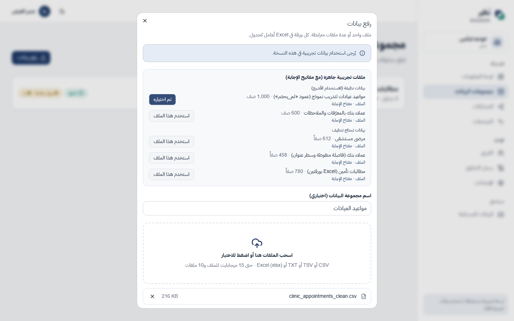
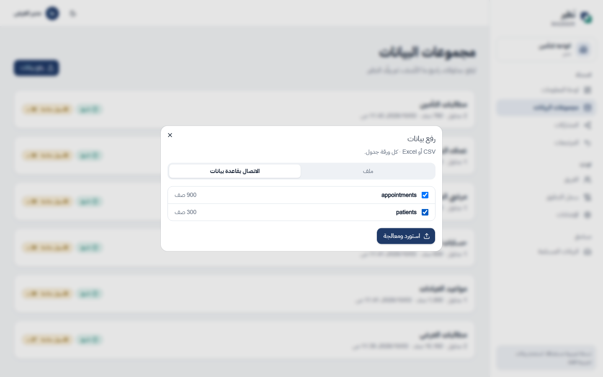
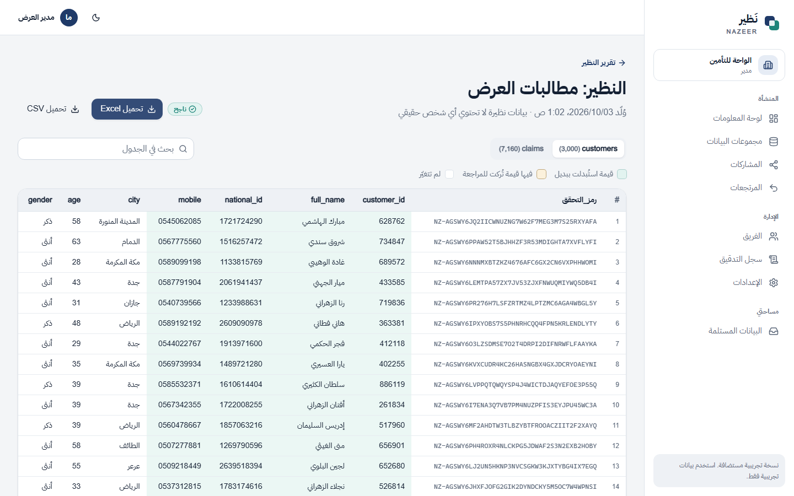
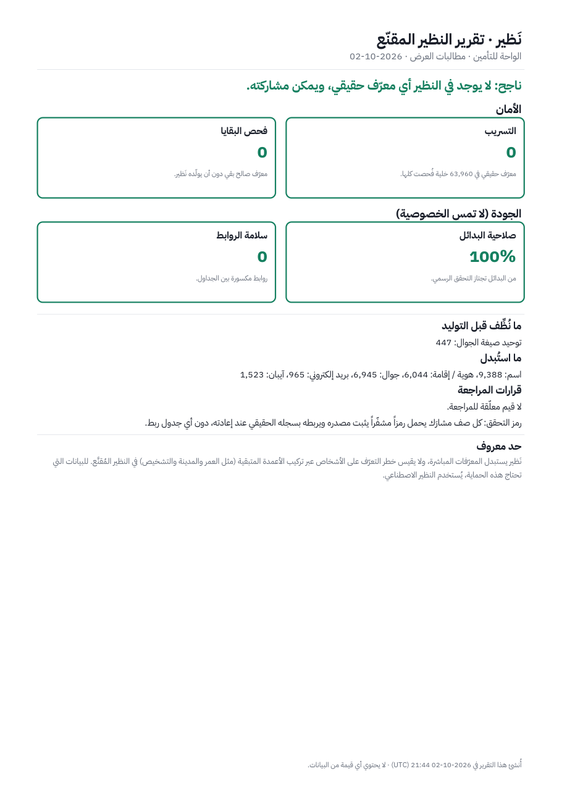
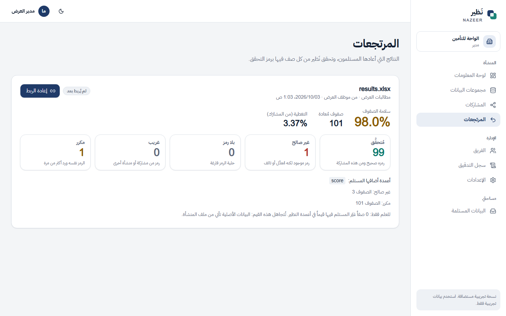
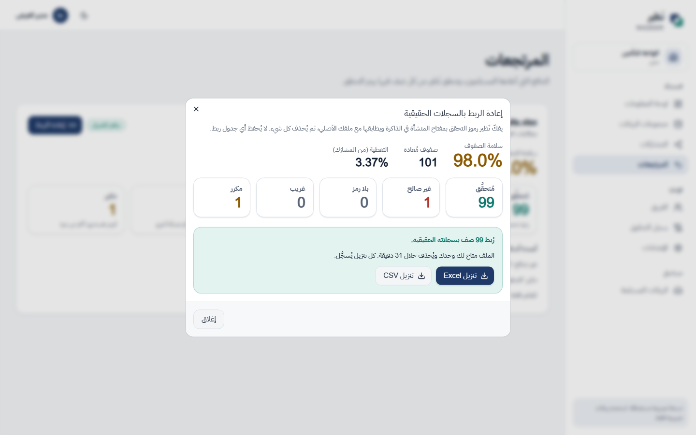
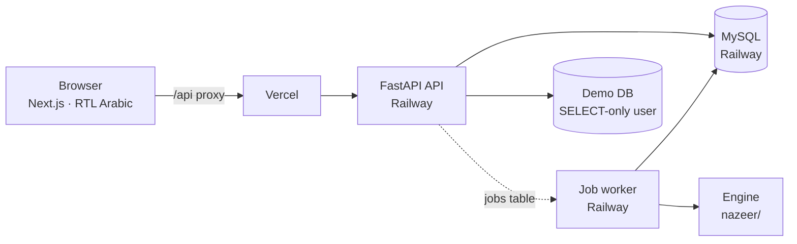

<div align="center">

# نَظير · Nazeer

**شارك بيانات واقعية، بلا أي شخص حقيقي.**<br>
**Share realistic data, with no real person in it.**

[الموقع المباشر · Live site](https://nazeer-three.vercel.app) ·
[English ↓](#nazeer-in-english)

</div>



## ما هو نَظير؟

منصّة ويب عربية متعددة المنشآت. ترفع المنشأة جداولها، فيكتشف نَظير البيانات الشخصية في الأعمدة **وداخل
الملاحظات العربية الحرة**، ثم يولّد **نظيرًا** للبيانات: نفس الشكل والعلاقات والتوزيعات، لكن كل هوية وجوال
وآيبان واسم مستبدل بقيمة وهمية **صالحة** ومتسقة. يفحص نَظير النتيجة ويصدر حكمًا **ناجح / راسب** بتقرير عربي
من صفحة واحدة، ولا يمكن مشاركة نظير راسب. يستلم الشريك النظير، ويعيد نتائجه، فيربطها مدير المنشأة بسجلاته
الحقيقية **دون أي جدول ربط محفوظ**.

### الرحلة كاملة



### جرّبه في دقيقتين
1. افتح [nazeer-three.vercel.app](https://nazeer-three.vercel.app) وأنشئ حساب منشأة (مجاني، بلا بريد تأكيد).
2. في «مجموعات البيانات» اختر **«استخدم هذا الملف»** على أحد الأمثلة الخمسة (عيادة، بنك، مستشفى، تأمين)،
   أو تبويب **قاعدة البيانات** للاتصال بقاعدة عرض للقراءة فقط.
3. راجع ما اكتُشف، ثم **«ولّد النظير»**، واقرأ التقرير، وحمّله PDF.
4. شارك النظير برابط، وافتحه من حساب ثانٍ، وأعِد ملف نتائج، ثم أعِد ربطه من حساب المدير.

> كل البيانات في الأمثلة وقاعدة العرض **مولَّدة**، ولا تخص أي شخص حقيقي.

### ما الذي يميّزه

| | ماذا يفعل | النتيجة المقاسة |
|---|---|---|
| **اكتشاف يبدأ بالتحقق** | الرقم يُعدّ هوية فقط إذا اجتاز رقم التحقق الرسمي (Luhn للهوية والإقامة، mod-97 للآيبان)، مع أرقام عربية ومسافات و`+966` | 100% لكل نوع على ملفات الأمثلة الخمسة، و**0** أرقام مشابهة (فواتير وطلبات) استُبدلت خطأً |
| **بدائل صالحة ومتسقة** | البديل يجتاز نفس التحقق، ونفس القيمة تأخذ نفس البديل في كل الجداول (HMAC بمفتاح المنشأة) | **100%** من البدائل صالحة، و**0** مفاتيح أجنبية يتيمة |
| **قرارات إحصائية للقيم الملتبسة** | الأرقام التي تشبه الهوية في سياق غير شخصي تُجمع وتُختبر: هل تجتاز رقم التحقق أكثر من صدفة الـ 10%؟ (اختبار ذي الحدين، α = 0.01، وحد أدنى Clopper–Pearson ≥ 0.80) | القرار ونسبته مكتوبان في التقرير، وما لا يُحسم يُعرض على المدير |
| **فحص بقايا مستقل** | بعد التوليد يُمسح كل النظير بحثًا عن أي هوية أو جوال أو آيبان صالح لم يولّده نَظير | أي بقية = **راسب**، ويُمنع النظير من المشاركة |
| **رمز تحقق لكل صف** | عمود `رمز_التحقق`: المفتاح الأصلي مشفّر بـ AES-SIV بمفتاح المنشأة ومربوط بالمشاركة، بحروف لا يغيّرها Excel | الصف المعدّل أو المنسوخ من مشاركة أخرى يُرفض؛ إعادة الربط في الذاكرة فقط |

### الأمان باختصار
- **عزل تام بين المنشآت:** كل طلب مقيّد بالمنشأة، ومعرّف منشأة أخرى يعيد 404.
- **لا جدول ربط:** إعادة الربط تُحسب في الذاكرة بمفتاح المنشأة، والنتيجة متاحة للمدير 30 دقيقة ثم تُحذف.
- **مفاتيح المنشآت مشفّرة** (AES-256-GCM) بمفتاح رئيسي في بيئة الخادم فقط.
- **سجلات بلا قيم:** سجل التدقيق والأخطاء يحويان معرّفات وأعدادًا فقط.
- **جلسات آمنة:** كوكي httpOnly، وحماية CSRF، وكلمات مرور Argon2id، وحدّ للمحاولات.
- **قاعدة العرض للقراءة فقط:** مستخدم بصلاحية SELECT، وبياناته في متغيرات الخادم فقط.

### صور من المنصّة

| | |
|---|---|
|  |  |
| أمثلة جاهزة بنقرة واحدة | الاتصال بقاعدة بيانات للقراءة فقط |
|  |  |
| النظير مع رمز التحقق لكل صف | تقرير عربي واضح، ونسخة PDF من صفحة واحدة |
|  |  |
| تحقق من كل صف في ملف المستلم | إعادة الربط لمدير المنشأة فقط |

### حدود نذكرها بصراحة
- نَظير يستبدل المعرّفات المباشرة، ولا يقيس خطر التعرّف عبر تركيب الأعمدة الباقية (العمر والمدينة والتشخيص).
  لهذه الحالات يوجد النظير الاصطناعي في المحرّك.
- الاكتشاف لا يكون كاملًا أبدًا: ما يفوت المكتشِف في النص الحر قد يبقى. فحص البقايا يلتقط الأرقام الصالحة، لا
  الأسماء.
- النظير المقنّع يبقى غالبًا بيانات شخصية نظامًا، لأن من يملك المفتاح يستطيع الربط.
- الأرقام أعلاه على بيانات مولَّدة، ولا تتنبأ بالأداء على بيانات حقيقية.
- النسخة المستضافة للعرض؛ النشر المقصود داخل المنشأة نفسها.

---

## Nazeer in English

Nazeer is a hosted, multi-tenant, Arabic-first web platform. An organization uploads tables; Nazeer finds
personal data in columns **and inside free-text Arabic notes** (Arabic-Indic digits, spaces, `+966`), then
generates a **twin**: the same shape, relationships and distributions, with every national ID, iqama, mobile,
IBAN and name replaced by a **valid**, consistent fake. Every twin gets a **PASS / FAIL** verdict and a
one-page Arabic report; a failing twin cannot be shared. Recipients return their results, and an organization
admin re-links them to the real records **with no stored mapping table**.

**Try it:** open the [live site](https://nazeer-three.vercel.app), create an organization account, pick one of
the five example files («استخدم هذا الملف») or the read-only demo database, generate the twin, read the report,
share it, return a results file from a second account, and re-link it as the admin. All example data is
generated; none of it belongs to a real person.

### What makes it different
- **Validator-first detection.** A number counts as an ID only if it passes the official check digit (Luhn
  for national ID / iqama, mod-97 for IBAN). Measured on the five example files: 100% recall per type, cleaned
  or not, and **0** look-alike invoice/order numbers replaced by mistake.
- **Valid, consistent fakes.** Each fake passes the same validator; the same real value maps to the same fake
  across tables (keyed HMAC). 100% valid fakes, 0 orphan foreign keys.
- **Statistical decisions on uncertain values.** ID-shaped numbers in non-personal contexts are grouped and
  tested: do they pass the check digit more often than the 10% expected by chance (binomial test, α = 0.01,
  Clopper–Pearson lower bound ≥ 0.80)? The decision and its numbers are written in the report; anything
  undecided goes to the admin.
- **Independent residual scan.** After generation, the whole twin is scanned for any valid ID, mobile or IBAN
  that Nazeer did not generate. Any hit is a FAIL, and sharing is blocked.
- **Per-row verification token.** A `رمز_التحقق` column holds the row's original key sealed with AES-SIV
  under the organization key and bound to the share, in an Excel-safe alphabet. Altered rows and rows from
  another share are rejected; re-linking happens in memory only, for admins only.

### Architecture



- **Engine (`nazeer/`)**: ingestion, cleaning, profiling, detection, review decisions, transform, evaluation,
  report. Pure Python, unit-tested on its own.
- **API (`nazeer_api/`)**: FastAPI, SQLAlchemy 2, Alembic migrations, a DB-backed job queue (no Redis),
  Argon2id passwords, CSRF double-submit cookies, per-org encrypted keys (AES-256-GCM), value-free audit log,
  PDF report (fpdf2 + HarfBuzz shaping, bundled Arabic font).
- **Web (`web/`)**: Next.js App Router, Tailwind, shadcn/Base UI, fully right-to-left, light and dark mode.

### Security model
- Tenant isolation on every route (another organization's IDs return 404).
- No mapping table: re-linking recomputes in memory with the organization key; the output is kept 30 minutes.
- Organization keys encrypted under a master key held only in server environment variables.
- Logs and the audit trail hold IDs, counts and codes, never data values.
- The demo database is reached through a SELECT-only user whose credentials live only in server env vars.
- Known risk, stated plainly: a full backend compromise could decrypt organization keys. This is why the
  intended real-world deployment is on-premise; the hosted version is a demonstration.

### Run locally (PowerShell, Python 3.11, Node 20+)
```powershell
py -3.11 -m venv .venv; .\.venv\Scripts\Activate.ps1
pip install -r requirements.txt -r requirements-api.txt
python -m pytest                                   # engine + API tests

$env:DATABASE_URL = "sqlite:///nazeer_app.db"
$env:NAZEER_MASTER_KEY = python -c "import os,base64;print(base64.urlsafe_b64encode(os.urandom(32)).decode())"
$env:COOKIE_SECURE = "0"; $env:MAIL_BACKEND = "memory"
alembic -c nazeer_api\alembic.ini upgrade head
uvicorn nazeer_api.main:app --port 8000            # second window: python -m nazeer_api.worker
cd web; npm install; npm run dev                   # http://localhost:3000 (proxies /api/*)
```
The engine also runs on its own from the command line:
```powershell
$env:NAZEER_KEY = "<at least 32 random characters>"
python -m data_gen.make_demo_data --seed 42 --n 3000
python -m nazeer.pipeline --csv data\demo --mode masked --out out\masked
```
Hosted deployment (Vercel + Railway): see [docs/DEPLOY.md](docs/DEPLOY.md).

### Tests
- **391** engine and API tests (`tests/`, `tests_api/`), run in CI on every push with the web lint, type check
  and build (`.github/workflows/ci.yml`).
- An end-to-end browser test (`scripts/e2e_web.py`, Playwright) runs the full flow against the live site.
- Answer keys for every example file (`web/public/samples/*_answer_key.csv`) let anyone check detection
  in the app («تحقق بمفتاح إجابة») or with `scripts/eval_answer_key.py`.

### Known limitations
- Nazeer replaces direct identifiers. It does not measure re-identification risk from combinations of the
  remaining columns (age, city, diagnosis) in the masked twin; the engine's synthetic twin covers that case.
- Detection is never complete. Missed free text stays; the residual scan catches valid numbers, not names.
- The masked twin is most likely still personal data in law: the key holder can re-link it.
- A format-valid fake may coincide with a real person's value outside the dataset.
- The numbers above come from generated data and do not predict performance on real production text.
- SDV (used by the synthetic twin) is licensed BUSL-1.1.

### Repository map
| Path | Contents |
|---|---|
| `nazeer/` | The engine (detection, cleaning, transform, evaluation, report) |
| `nazeer_api/` | FastAPI app, models, migrations, worker, PDF report |
| `web/` | Next.js website (`web/public/samples/`: example files and answer keys) |
| `tests/`, `tests_api/` | Engine and API tests |
| `scripts/` | E2E test, sample generators, answer-key evaluation |
| `docs/` | Deployment guide, build log ([PROGRESS.md](docs/PROGRESS.md)), screenshots |
